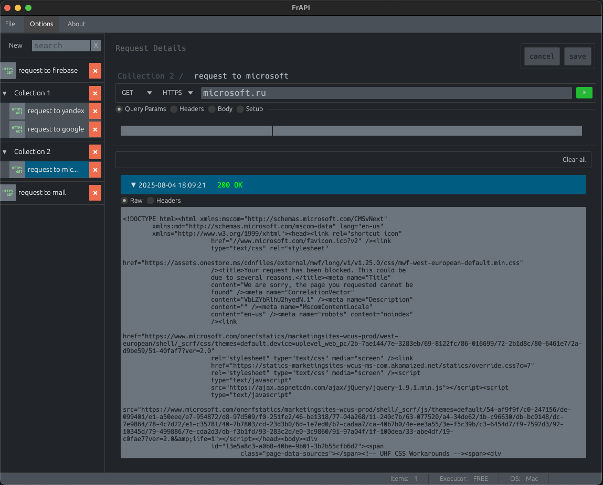

### FrAPI - Free API client/server tester.

## Description

This application made purely with Rust lang. Aiming to fast API requests mostly.  
At same time analog of `Postman`, but more lightweight, without any telemetry and have less functions.  
Excelent if you need to test something fast here and now with limited resources.
Also this application planned as mocking API server for test purpose, supporting complex data models constructor and some basic operations with data.

### !! This application under heavy development !!

Pros:

-   lightweight
-   easy to deploy - only one file
-   no telemetry, accounts, clouts, etc...
-   faster
-   can be build under any OS, where Rust libs used available (OSX, Windows, Linux, etc...)

Cons:

-   less functions, compared with `Postman`
-   no shared data for teams
-   ui abit clumsy (yet)
-   limited protocols available

### Build

To Build manualy

1. Install `Rust 1.88.0`
2. Navigate to project directory and execute from terminal:
   `cargo build`

### Roadmap:

1. Create working build with basic client reqeust info
2. Create `Settings` page with some base settings
3. Add self hosting servers with models builders for mocking data
